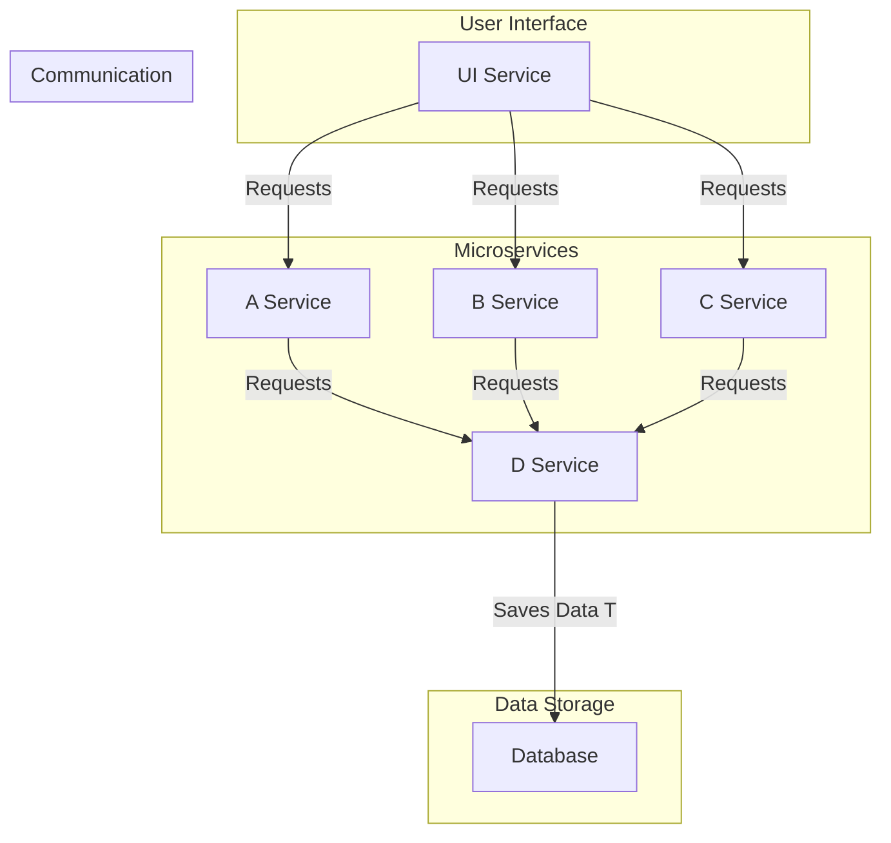
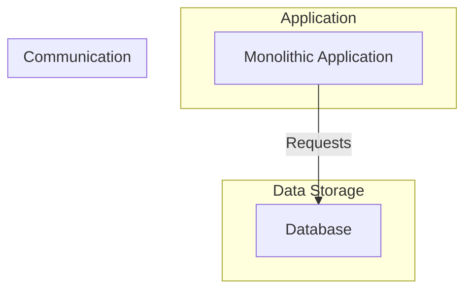

```mermaid
graph TD;
  subgraph User Interface
    UI[UI Service]
  end
  subgraph Microservices
    A[A Service]
    B[B Service]
    C[C Service]
    D[D Service]
  end
  subgraph Data Storage
    DB[Database]
  end
  subgraph Communication
    UI--Requests-->A
    UI--Requests-->B
    UI--Requests-->C
    A--Requests-->D
    B--Requests-->D
    C--Requests-->D
    D--Saves Data To-->DB
  end
```

```mermaid
graph TD;
  subgraph Application
    App[Monolithic Application]
  end
  subgraph Data Storage
    DB[Database]
  end
  subgraph Communication
    App--Requests-->DB
  end
```